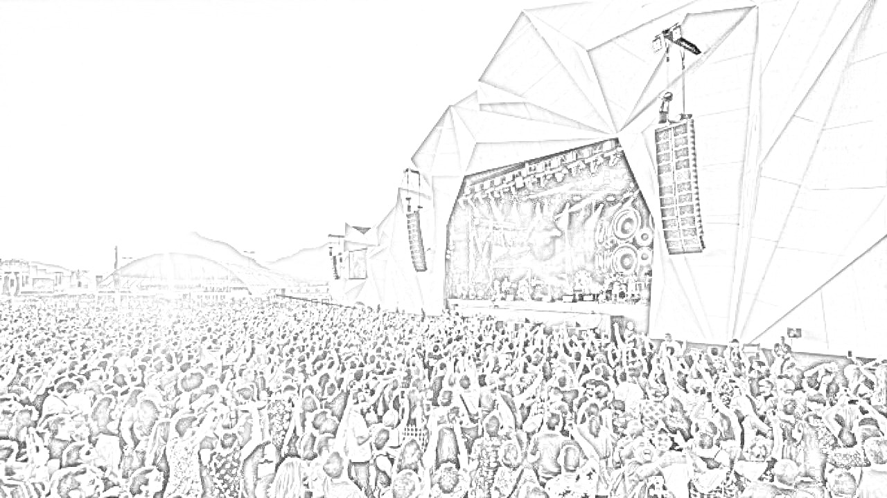

# photoToDrawing
This program converts photos to images that look like drawings.
I decided to make this program as a way to introduce myself to openCV and some basic commands.
Run and test! There are some example images in the repository. Some generate better results than others. I will try to fix this in the future by treating the thresholds differently.
Take a look at this example!

1)Original photo:

2)Photo after running the program
